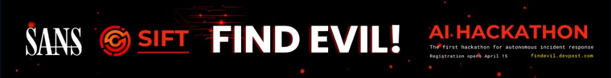

# VERDICT

<p align="center">
  <a href="https://findevil.devpost.com/">
    
  </a>
</p>

<p align="center">
  <strong>Every finding cited, every action audited, zero hallucinated evil.</strong>
</p>

<p align="center">
  <a href="https://github.com/prabhakaran-jm/verdict/blob/main/LICENSE"></a>
  <a href="https://www.python.org/downloads/"></a>
  <a href="https://findevil.devpost.com/"></a>
  <a href="https://www.sans.org/tools/sift-workstation/"></a>
  <a href="docs/architecture.md"></a>
</p>

<p align="center">
  <a href="#try-it-smoke-case--3-minutes-pennies">Quick start</a> ·
  <a href="#full-szechuan-sauce-walkthrough">Full case</a> ·
  <a href="#architecture">Architecture</a> ·
  <a href="docs/accuracy-report.md">Accuracy report</a> ·
  <a href="docs/execution-logs/">Execution logs</a>
</p>

---

Autonomous DFIR on a SIFT Workstation — one command runs survey, triage, adversarial
verification, and a cited report. A custom **read-only MCP server** wraps Sleuth Kit,
Volatility 3, YARA, and EZ Tools; the model never gets a shell.

```bash
verdict investigate <case-folder>
```

Safety is **architectural**: thirteen typed forensic tools only — **no shell tool exists
to disable**. The server enforces path guard, fixed binaries, output caps, and a
single-writer append-only `ledger.jsonl`.

Built for the [FIND EVIL!](https://findevil.devpost.com/) hackathon · [Devpost story](docs/devpost-story.md)

| | Smoke case | Full Szechuan |
|---|:---:|:---:|
| **Size** | ~3 MB (in repo) | ~25–30 GB ([download](docs/dataset.md)) |
| **Time** | ~3–4 min | ~30–60 min |
| **Cost** | ~$0.30–0.50 | ≤ **$5.00** (budget guard) |
| **Best for** | Judges, demo, CI | Accuracy report |

---

## Try it (smoke case — ~3 minutes, pennies)

The bundled smoke case is sanitized Windows artifacts. It exercises the full pipeline —
survey → triage → verify → report — including the demo centerpiece: a **`REFUTED`** flip
when the verifier catches an overclaim on the `mimikatz.exe` decoy (12 bytes of ASCII
text, not malware).

### 1. Set up on the SIFT VM

```bash
git clone https://github.com/prabhakaran-jm/verdict.git
cd verdict
python3 -m venv .venv
source .venv/bin/activate
pip install -e .

export ANTHROPIC_API_KEY=sk-ant-...   # required — VERDICT calls Claude autonomously
```

Optional sanity check (forensic binaries on PATH):

```bash
python -m verdict_mcp.binaries --check
```

### 2. Run the smoke investigation

```bash
verdict investigate ./cases/smoke/
```

Within ~10 seconds: case validated, evidence inventory, stated plan. The run narrates
each tool call, shows a live cost ticker, runs triage then verify, and prints a findings
summary.

### 3. Open the report

```bash
ls runs/
# e.g. runs/20260613T092457Z/report.html
```

Open `report.html` in a browser. Click a citation — it jumps to the matching
`ledger.jsonl` entry (tool, args, output SHA-256). `report.pdf` is generated alongside.

### 4. What to look for

| Beat | Where |
|------|--------|
| Service install (`VerdictSmokeSvc` → `update.exe`) | VERIFIED · System.evtx / 7045 |
| Run-key persistence | Registry · `NTUSER.DAT` |
| YARA hit on invoice marker | `yara_scan` · `rules/smoke.yar` |
| **`REFUTED` decoy** | `mimikatz.exe` flipped in verify — plain text, not credential dumping |

### 5. Clean-case control (optional)

```bash
verdict investigate ./cases/clean/
```

Expect an honest empty report — **zero invented findings**.

---

## Full Szechuan Sauce walkthrough

Primary dataset: [The Case of the Stolen Szechuan Sauce](https://dfirmadness.com/the-stolen-szechuan-sauce/) — not in git. Download once on the VM.

### Download and verify

```bash
sudo mkdir -p /cases/szechuan && sudo chown "$USER" /cases/szechuan
./scripts/get-dataset.sh              # ~13.5 GB download, MD5-verified, auto-extract
pip install volatility3               # recommended in venv for mem_analyze
./scripts/day1-gate.sh /cases/szechuan   # optional: binaries + dataset + Vol3 gate
```

See [`docs/dataset.md`](docs/dataset.md) for provenance, MD5 table, and known constraints.

### Full run

```bash
source .venv/bin/activate
export ANTHROPIC_API_KEY=sk-ant-...
verdict investigate /cases/szechuan/ --budget 5.00 2>&1 | tee szechuan-transcript.txt
```

| Parameter | Typical value |
|-----------|----------------|
| Wall time | ~30–60 min |
| API cost | ≤ **$5.00** |
| Exit code | `0` on success |

Outputs under `runs/<UTC-timestamp>/`:

- `report.html` / `report.pdf` — ATT&CK-mapped findings with ledger citations
- `findings.json` — structured findings + verdicts
- `ledger.jsonl` — append-only audit trail
- `artifacts/` — files extracted from disk images during the run

**Accuracy** (vs published ground truth): [`docs/accuracy-report.md`](docs/accuracy-report.md) —
**~40% recall at 100% precision** on the primary run; every miss named.

---

## Requirements

| Requirement | Notes |
|-------------|-------|
| **Platform** | [SIFT Workstation](https://www.sans.org/tools/sift-workstation/) VM; dev on Windows host, **run on SIFT** |
| **Python** | 3.11+ |
| **API key** | `ANTHROPIC_API_KEY` — Claude Sonnet 4.6 for triage + verify |
| **Disk** | ~60 GB free for Szechuan; smoke case is a few MB |
| **Forensic stack** | Sleuth Kit, Volatility 3, YARA, EZ Tools — see `python -m verdict_mcp.binaries --check` |
| **Optional** | .NET for EZ Tools fallbacks; `pip install volatility3` in venv |

```bash
pip install -e .
```

---

## Architecture

<p align="center">
  <a href="docs/architecture.md">
    
  </a>
</p>

<p align="center">
  <a href="docs/architecture.md"></a>
</p>

Two processes: **orchestrator** (`verdict/`) + **read-only MCP server** (`verdict_mcp/`),
connected only by stdio. Phase allowlists, path guard, fixed binaries, and a server-only
ledger — not prompt-based safety. Mermaid source: [`docs/architecture.mmd`](docs/architecture.mmd).

<p align="center">
  
  
  
  
  
</p>

Full diagram: [`docs/architecture.md`](docs/architecture.md)

---

## Exit codes

| Code | Meaning |
|------|---------|
| **0** | Success — report + ledger written |
| **1** | Invalid or empty case folder |
| **2** | Interrupted — partial trail in run folder |
| **3** | Internal error / missing `ANTHROPIC_API_KEY` |

---

## Project docs

| Doc | Purpose |
|-----|---------|
| [`docs/architecture.md`](docs/architecture.md) | Security boundary diagram |
| [`docs/dataset.md`](docs/dataset.md) | Smoke + Szechuan provenance |
| [`docs/accuracy-report.md`](docs/accuracy-report.md) | Self-assessment vs ground truth |
| [`docs/execution-logs/`](docs/execution-logs/) | Ledgers + transcripts (submission #8) |
| [`docs/devpost-story.md`](docs/devpost-story.md) | Devpost narrative |
| [`docs/spec.md`](docs/spec.md) | Technical specification |
| [`docs/prd.md`](docs/prd.md) | Product requirements |
| [`docs/scope.md`](docs/scope.md) | Hackathon scope |

---

## License

Apache-2.0 — see [`LICENSE`](LICENSE).

<p align="center">
  <sub>GTG-1002 defender-side mirror · <a href="https://github.com/prabhakaran-jm/verdict">github.com/prabhakaran-jm/verdict</a></sub>
</p>
