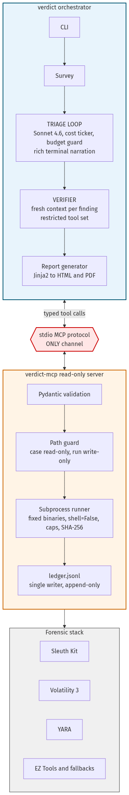
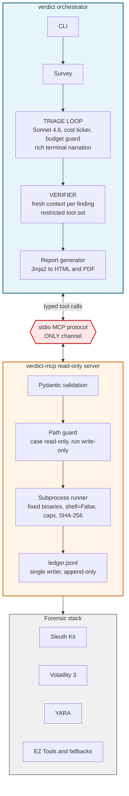
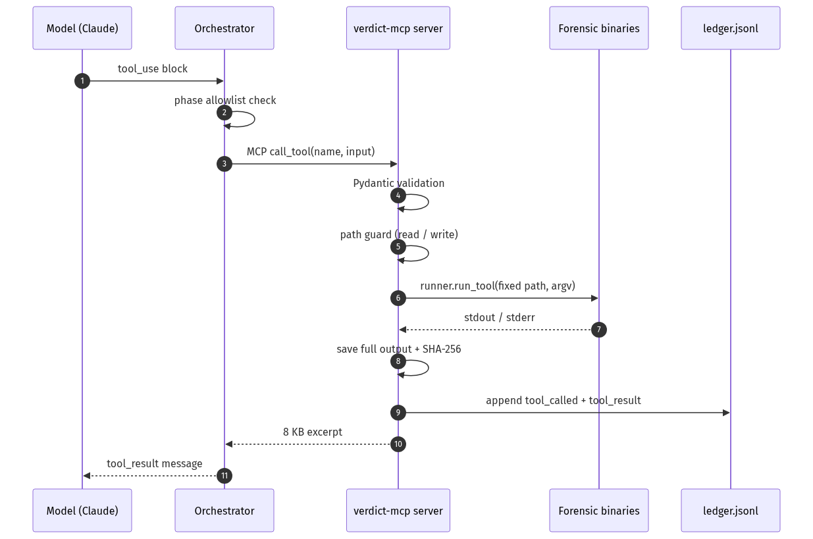
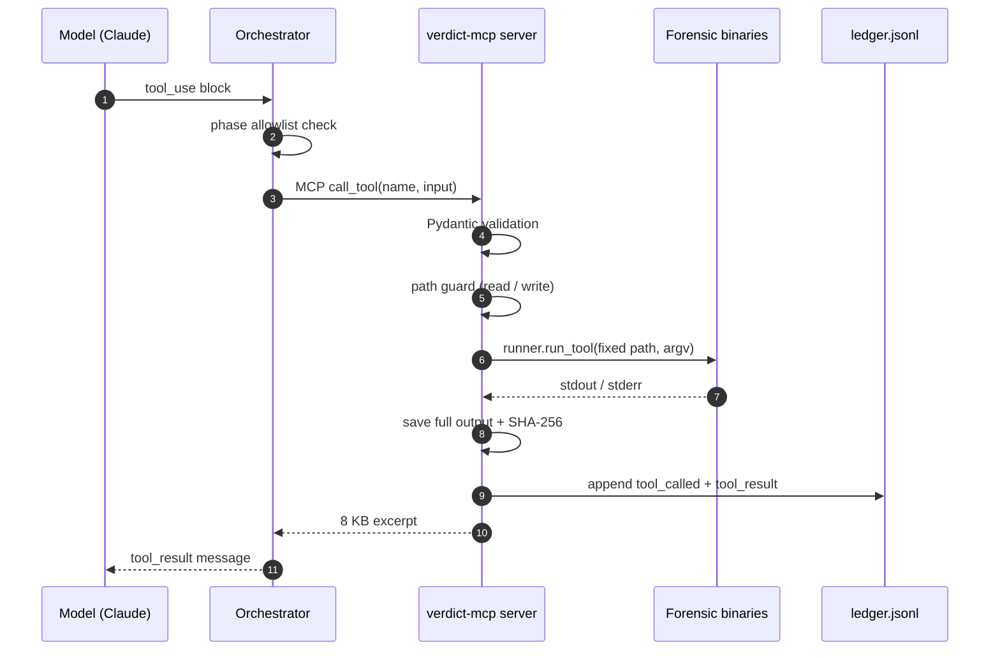

# VERDICT Architecture

Every finding cited, every action audited, zero hallucinated evil.

This document is the submission architecture diagram (`prd.md > Submission Package`).
It shows what the agent **physically cannot do** — not what a prompt asks it to avoid.

## Two processes, one hard boundary

Implements `prd.md > Constrained Tooling` and `spec.md > Architecture Overview`.



*Source: [`architecture.mmd`](architecture.mmd) — regenerate with `npx @mermaid-js/mermaid-cli -i docs/architecture.mmd -o docs/architecture.png` or [Kroki](https://kroki.io/).*

### Mermaid (renders on GitHub)



### ASCII (plain-text fallback)

```
┌────────────────────── verdict (orchestrator) ──────────────────────┐
│  CLI ─→ survey ─→ TRIAGE LOOP ─→ VERIFIER ─→ report generator      │
│         (Sonnet 4.6, manual loop)  (fresh context    (Jinja2 →     │
│          cost ticker · budget guard  per finding,     HTML/PDF)    │
│          rich terminal narration     restricted tools)             │
└──────────────┬─────────────────────────────────────────────────────┘
               │ stdio (MCP protocol) — the ONLY channel
┌──────────────▼────────────────── verdict-mcp (server) ─────────────┐
│  Pydantic validation → path guard → subprocess runner → LEDGER     │
│  (evidence dir: read-only allowlist · run dir: write-only)         │
│  (fixed binaries, shell=False, timeouts, output caps, SHA-256)     │
└──────────────┬─────────────────────────────────────────────────────┘
               ▼
   Sleuth Kit · Volatility 3 · YARA · EZ Tools / static fallbacks
```

The orchestrator never shells out to forensic tools directly. Every action crosses
stdio as a typed MCP tool call; the server is the only code that touches binaries,
paths, and the ledger.

## Security boundary

The model's **only actuators** are the typed MCP tools placed in its `tools` array
for the current phase. There is:

- **No bash tool**
- **No file-write tool**
- **No arbitrary-command tool**

Not disabled — **absent**. The manual agent loop (Anthropic API) sends only the
allowlisted tool definitions; harmful capabilities never exist in the request.

Even if the orchestrator were compromised or confused, the server independently
enforces:

| Layer | What it blocks |
|-------|----------------|
| **Pydantic schemas** | Unknown tools, unknown parameters, out-of-range enums (e.g. Vol3 plugin allowlist) |
| **Phase allowlists** | Triage vs verify tool sets — orchestrator double-gate + server metadata |
| **Path guard** | Reads only under `--case` or `--run`; writes **only** under `--run` |
| **Runner** | Fixed executable paths from `binaries.py` (never from model input), `shell=False`, timeouts, output caps |
| **Ledger** | Single writer: the MCP server. The model has no tool that appends to `ledger.jsonl` |

Violations produce a clean `tool_rejected` ledger line and a model-readable error —
never a traceback, never silent failure.

### Phase tool allowlists

| Phase | Tools in the model's `tools` array |
|-------|--------------------------------------|
| **Triage** | Tools 1–12 (`evidence_inventory` … `record_finding`) |
| **Verify** | Tools 2–11 + `record_verdict` (no `record_finding`, no `evidence_inventory`) |
| **Orchestrator-only** | `_log_event` — control-plane logging, never shown to the model |

The canonical lists live in `verdict_mcp/tools/__init__.py` (`TRIAGE_TOOLS`,
`VERIFY_TOOLS`). The orchestrator refuses hallucinated tool names before MCP; the
server's rejection boundary catches anything that slips through.

## Data flow (one tool call)





*Source: [`architecture-dataflow.mmd`](architecture-dataflow.mmd)*

### ASCII (plain-text fallback)

```
Model tool_use block
    → orchestrator phase check
    → MCP ClientSession.call_tool(name, input)
    → FastMCP Pydantic validation
    → pathguard.resolve_read / resolve_write
    → runner.run_tool(fixed_binary, argv, timeout)
    → full output → runs/<id>/outputs/<seq>_<tool>.*  (+ SHA-256)
    → 8 KB excerpt returned to model
    → ledger.jsonl: tool_called + tool_result (server-only append, fsync)
```

Findings and verdicts flow through `record_finding` / `record_verdict` (also
server-mediated). The report generator reads `findings.json` + `ledger.jsonl`; citations
link finding rows to ledger sequence numbers.

## What the agent cannot do (demonstration)

**Ask it to delete a file — watch the architecture refuse.**

There is no delete tool in the 13-tool surface. If triage somehow asked to remove
evidence, the model would have to hallucinate a tool name — rejected by the phase
allowlist and ledgered as `tool_rejected`.

If a handler tried to open an evidence path for writing, `PathGuard.resolve_write`
raises `PathViolation` before any I/O:

- Evidence under `--case` is **read-only** (disk images, `.evtx`, memory captures).
- The only writable root is `--run` (extracted artifacts, tool outputs, reports).

Example refusal shape (from `pathguard.py` policy):

> write to `…/cases/smoke/mimikatz.exe` denied — writes are allowed only under the run directory

The agent also cannot tamper with its audit trail: `_log_event` and direct ledger
writes are orchestrator-only; the model never receives a "write ledger" or "edit
finding" tool.

This is the wedge vs prompt-based guardrails (Protocol SIFT, generic agent
frameworks): safety is **structural**, not instructional.

## Why manual loop instead of Claude Agent SDK

The Agent SDK ships bash and file tools that must be **disabled by configuration** —
a permission the model or operator can re-enable. VERDICT's manual loop means each
API request contains **only** the typed forensic tools. Tradeoff: more orchestrator
code; payoff: the harmful capability never exists.

See `spec.md > Key Technical Decisions` for timeline (bodyfile/mactime vs Plaso),
verifier model choice (Sonnet 4.6), and smoke-case design.

## Related docs

- Tool definitions and schemas: `spec.md > MCP Server > Tool definitions`
- Binary matrix and Day-1 gate: `scripts/day1-gate.sh`, `verdict_mcp/binaries.py`
- Dataset layout (not in git): `docs/dataset.md`

## Regenerating diagram images

```bash
# Option A: Mermaid CLI (requires Node.js)
npx @mermaid-js/mermaid-cli -i docs/architecture.mmd -o docs/architecture.png
npx @mermaid-js/mermaid-cli -i docs/architecture-dataflow.mmd -o docs/architecture-dataflow.png

# Option B: Kroki (no local install)
curl -sS -X POST https://kroki.io/mermaid/png -H "Content-Type: text/plain" \
  --data-binary @docs/architecture.mmd -o docs/architecture.png
```
